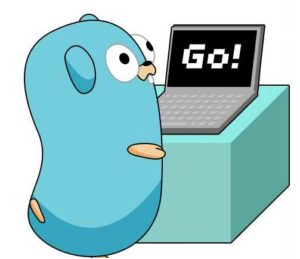

# go learn go

A workshop for learning the basic concepts of [Go](https://golang.org/) (or Golang).

# Prerequisites
## Skills requirements
* basic OO programming concepts;
* basic concepts of memory access (i.e. pointers);

## Software requirements
* you could use any OS you want (Go is available for Linux, FreeBDS, macOS and Windows);
* Go 1.10 (or higher). Please check [this page](https://golang.org/doc/install) before you start;
* in this workshop, we'll be using GoLand but you can choose the IDE (or the text editor) you prefer. 
    Make sure your IDE is fully working during the workshop.
    Some popular IDEs are:
    * GoLand (preferred) : all-included JetBrain's IDE for Go. A free 30-day trial may be found [here](https://www.jetbrains.com/go/);
    * vsc + Go: Visual Studio Code includes some rich features for Go. You can find detailed instructions [here](https://code.visualstudio.com/docs/languages/go).
    * vim + vim-go (expert only, **no one will explain to you how to quit from vim**): vim-go offers a rich set of features, 
    helping you to write Go into your vim editor. Vim can be found [here](https://www.vim.org/) and vim-go can be found [here](https://github.com/fatih/vim-go);

# Workshop 1
Through this workshop you will learn how to build a basic Go application, using basic syntax, types, structs, interfaces and so on.
We will discuss each new concept, trying to understand design decisions and comparing each aspect of Go with other
programming languages.

## Workshop goals
1. Starting a simple Go project using Goland;
2. Understanding Go basic syntax;
3. Understanding Go types and Structural Typing;
4. Understanding Go's peculiarity compared to other programming languages;
5. Understanding the differences between pointers and values in Go. 

# Further reading
* https://golang.org    (official website)
* https://go-tour-ita.appspot.com/welcome/1   (an interactive tour through Go)
* http://www.golangbootcamp.com/    (comprehensive Go tutorial)
* https://blog.golang.org/  (official blog)
* https://golangcode.com/   (a library of useful Go snippets)
* https://golangbot.com/    (tutorials for beginners)
* https://appliedgo.net/    (tutorials and explanations for advanced users)
* https://changelog.com/gotime  (Go podcast)
* https://dave.cheney.net/category/golang   (another blog of Go)
* https://golang.ch/    (Go news, libraries and tutorials)
* https://www.golangprograms.com/   (Go blog and tutorials for mid-advanced users)
* https://medium.com/@trevor4e/learning-gos-concurrency-through-illustrations-8c4aff603b3   (clear explanation about Go concurrency)
* https://awesome-go.com/   (a list of Go frameworks and libraries)
* https://medium.com/a-journey-with-go  (tutorials for advanced users)
* https://hub.packtpub.com/concurrency-and-parallelism-in-golang-tutorial/ (a detailed explanation about Go parallelism)

For the full list of references please see: https://dariodip.github.io/gows/goref2019/

# Author

[Dario Di Pasquale](https://dariodip.github.io)

